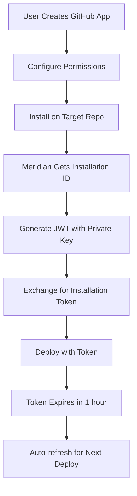

# GitHub Authentication Security Analysis for Meridian

**Created:** December 30, 2024  
**Context:** Reducing permissive access tokens for Meridian's GitHub deployment feature

## Executive Summary

Currently, Meridian uses **Classic Personal Access Tokens** which grant broad access to all user repositories - a significant security risk. This analysis compares authentication options to find the most secure approach for repository-specific deployment.

**Recommendation:** Implement **Fine-grained Personal Access Tokens** as the primary solution, with **GitHub Apps** as an advanced option for enterprise users. Integration with Meridian's existing workspace-scoped credential management system provides secure, encrypted storage and multi-account support.

---

## Current Security Issue

### Classic PAT Problems (Current Implementation)

- ❌ **All-Repository Access**: Token grants access to ALL repositories user can access
- ❌ **Broad Permissions**: Requires `repo` scope which includes admin rights
- ❌ **Long-lived**: Tokens don't expire automatically
- ❌ **User-tied**: If user leaves org, automation breaks
- ❌ **Hard to Audit**: Difficult to track what token is used where
- ❌ **No Persistence**: Users must re-enter tokens for each deployment
- ❌ **No Validation**: No token type detection or permission verification

### Real-world Risk

```
Classic Token with 'repo' scope = Access to:
├── All personal repositories (read/write/admin)
├── All organization repositories (where user has access)
├── Repository settings and webhooks
├── Issues, PRs, wiki, pages
└── Collaborator management
```

---

## Integration with Meridian's Credential System

### Current Architecture Analysis

Meridian has a robust workspace-scoped credential management system:

```typescript
// From src/main/credential-manager.ts
export class CredentialManager {
  // Uses Electron's safeStorage for OS-native encryption
  // Workspace-specific credential storage
  // Pattern: service:key format for credential keys
  // Supports multiple accounts per platform
}
```

**Security Features:**

- ✅ **OS-native encryption** via Electron's `safeStorage`
- ✅ **Workspace isolation** - credentials scoped to specific projects
- ✅ **Encrypted storage** in `.meridian/config/credentials.json`
- ✅ **Multi-account support** - multiple accounts per platform
- ✅ **Graceful fallback** - base64 encoding in development

### GitHub Integration Strategy

#### 1. Add GitHub as Platform

```typescript
// Update src/types/index.ts
export type Platform = "bluesky" | "farcaster" | "twitter" | "x" | "github";

// Update credential store interface
export interface CredentialStore {
  bluesky?: { jwt: string; refreshToken: string };
  farcaster?: { appKey: string; jwt: string };
  twitter?: { accessToken: string; refreshToken: string };
  arweave?: { walletJWK: string };
  github?: {
    token: string;
    tokenType: "classic" | "fine-grained" | "github-app";
    repositories?: string[];
    expiresAt?: string;
  };
}
```

#### 2. GitHub Account Management

```typescript
// New interface for GitHub accounts
export interface GitHubAccount {
  id: string; // UUID
  nickname: string; // User-defined name
  username: string; // GitHub username
  tokenType: "classic" | "fine-grained" | "github-app";
  repositories: string[]; // Accessible repos for fine-grained
  expiresAt?: string; // Token expiration
  createdAt: string;
  lastUsed: string;
}

// GitHub Manager class
export class GitHubManager {
  private credentialManager: CredentialManager;

  async addAccount(
    token: string,
    nickname: string,
    tokenType: "classic" | "fine-grained" = "fine-grained"
  ): Promise<GitHubAccount> {
    // Validate token and get user info
    const userInfo = await this.validateToken(token);

    // Store account metadata
    const account: GitHubAccount = {
      id: randomUUID(),
      nickname,
      username: userInfo.login,
      tokenType,
      repositories: userInfo.repositories || [],
      expiresAt: userInfo.expiresAt,
      createdAt: new Date().toISOString(),
      lastUsed: new Date().toISOString(),
    };

    // Store in credential manager
    await this.credentialManager.setCredential(
      "github",
      `token:${account.id}`,
      token
    );

    await this.credentialManager.setCredential(
      "github",
      `account:${account.id}`,
      JSON.stringify(account)
    );

    return account;
  }

  private async validateToken(token: string): Promise<{
    login: string;
    tokenType: "classic" | "fine-grained";
    repositories?: string[];
    expiresAt?: string;
  }> {
    // GitHub API call to validate token and determine type
    const response = await fetch("https://api.github.com/user", {
      headers: {
        Authorization: `Bearer ${token}`,
        Accept: "application/vnd.github.v3+json",
      },
    });

    if (!response.ok) {
      throw new Error("Invalid GitHub token");
    }

    const user = await response.json();

    // Detect token type by checking scopes
    const scopes = response.headers.get("X-OAuth-Scopes");
    const tokenType = scopes?.includes("repo") ? "classic" : "fine-grained";

    return {
      login: user.login,
      tokenType,
      repositories:
        tokenType === "fine-grained"
          ? await this.getAccessibleRepositories(token)
          : undefined,
      expiresAt: undefined, // TODO: Extract from token if available
    };
  }
}
```

#### 3. Secure Storage Implementation

```typescript
// Integration with existing credential manager
export class CredentialManager {
  // ... existing methods ...

  /**
   * Get required credential keys for each platform
   */
  private getRequiredCredentialKeys(service: Platform): string[] {
    switch (service) {
      case "bluesky":
        return ["jwt", "refreshToken"];
      case "farcaster":
        return ["appKey", "jwt"];
      case "twitter":
        return ["accessToken", "refreshToken"];
      case "x":
        return ["apiKey", "apiSecret", "accessToken", "accessTokenSecret"];
      case "github":
        return ["token"]; // Minimal requirement
      default:
        return [];
    }
  }

  /**
   * GitHub-specific credential validation
   */
  public async validateGitHubCredentials(accountId: string): Promise<{
    isValid: boolean;
    tokenType: "classic" | "fine-grained";
    expirationWarning?: string;
    securityWarning?: string;
  }> {
    const token = await this.getCredential("github", `token:${accountId}`);
    if (!token) return { isValid: false, tokenType: "classic" };

    // Validate token with GitHub API
    const validation = await this.validateGitHubToken(token);

    const warnings = [];
    if (validation.tokenType === "classic") {
      warnings.push(
        "Classic token grants broad access - consider fine-grained PAT"
      );
    }

    if (validation.expiresAt) {
      const daysUntilExpiry = this.calculateDaysUntilExpiry(
        validation.expiresAt
      );
      if (daysUntilExpiry < 7) {
        warnings.push(`Token expires in ${daysUntilExpiry} days`);
      }
    }

    return {
      isValid: validation.isValid,
      tokenType: validation.tokenType,
      securityWarning:
        validation.tokenType === "classic" ? warnings[0] : undefined,
      expirationWarning: warnings.find((w) => w.includes("expires")),
    };
  }
}
```

### 4. Deploy Manager Integration

```typescript
// Update src/main/deploy-manager.ts
class DeployManager {
  private githubManager: GitHubManager;

  constructor() {
    this.githubManager = new GitHubManager();
    this.registerIpcHandlers();
  }

  private registerIpcHandlers(): void {
    // ... existing handlers ...

    // GitHub credential handlers
    ipcMain.handle("deploy:github-accounts", () =>
      this.githubManager.listAccounts()
    );
    ipcMain.handle("deploy:add-github-account", (_, token, nickname) =>
      this.githubManager.addAccount(token, nickname)
    );
    ipcMain.handle("deploy:validate-github-token", (_, accountId) =>
      this.githubManager.validateAccount(accountId)
    );
    ipcMain.handle("deploy:get-github-repositories", (_, accountId) =>
      this.githubManager.getAccessibleRepositories(accountId)
    );
  }

  async deployGitHub(config: any): Promise<any> {
    try {
      // Get token from credential manager instead of config
      const account = await this.githubManager.getAccount(
        config.githubAccountId
      );
      if (!account) {
        throw new Error("GitHub account not found");
      }

      const token = await this.credentialManager.getCredential(
        "github",
        `token:${account.id}`
      );

      if (!token) {
        throw new Error("GitHub token not found");
      }

      // Validate token before deployment
      const validation = await this.credentialManager.validateGitHubCredentials(
        account.id
      );
      if (!validation.isValid) {
        throw new Error("GitHub token is invalid or expired");
      }

      // Warn about security issues
      if (validation.securityWarning) {
        console.warn(`GitHub Security Warning: ${validation.securityWarning}`);
      }

      // Continue with deployment using secure token
      const deploymentConfig = {
        ...config,
        deployment: {
          ...config.deployment,
          personalAccessToken: token,
        },
      };

      return await this.performGitHubDeployment(deploymentConfig);
    } catch (error: any) {
      console.error("GitHub deployment failed:", error);
      return {
        success: false,
        error: error.message,
      };
    }
  }
}
```

---

## Authentication Options Comparison

| Factor                     | Classic PAT  | Fine-grained PAT  | GitHub App        | SSH Keys        | GITHUB_TOKEN      |
| -------------------------- | ------------ | ----------------- | ----------------- | --------------- | ----------------- |
| **Repository Scope**       | All repos    | Specific repos ✅ | Specific repos ✅ | Single repo     | Current repo only |
| **Permission Granularity** | Broad scopes | Fine-grained ✅   | Fine-grained ✅   | Read/Write only | Limited           |
| **Setup Complexity**       | Simple       | Simple ✅         | Complex           | Medium          | N/A (auto)        |
| **Security Level**         | Low          | High ✅           | Highest ✅        | Medium          | High              |
| **User Independence**      | User-tied    | User-tied         | Independent ✅    | User-tied       | Auto-managed      |
| **Expiration Control**     | Manual       | Required ✅       | Auto-refresh ✅   | Manual          | Auto (24h)        |
| **Audit Capability**       | Limited      | Good ✅           | Excellent ✅      | None            | Excellent         |
| **Rate Limits**            | 5K/hour      | 5K/hour           | Scales ✅         | N/A             | High              |
| **Meridian Integration**   | ✅ Simple    | ✅ Seamless       | 🚧 Complex        | ❌ Limited      | 🚧 Future         |

---

## Detailed Analysis

### 1. Fine-grained Personal Access Tokens (Recommended)

**Security Benefits:**

- ✅ Repository-specific access only
- ✅ Minimal required permissions
- ✅ Mandatory expiration dates
- ✅ Organization approval workflow
- ✅ Better audit trail

**Meridian Integration Benefits:**

- ✅ **Seamless Storage**: Uses existing encrypted credential system
- ✅ **Multi-Account Support**: Multiple GitHub accounts per workspace
- ✅ **Token Validation**: Built-in expiration and permission checking
- ✅ **Security Warnings**: Automatic detection of overprivileged tokens
- ✅ **Workspace Isolation**: Different tokens for different projects

**Required Permissions for Deployment:**

```yaml
Repository Permissions:
  - Contents: Read/Write # Clone, push files
  - Metadata: Read # Repository info
  - Pull Requests: Read # For conflict resolution
  - Actions: Write # Update workflow files
  - Pages: Write # Configure GitHub Pages

Organization Permissions:
  - None required
```

**UI Integration:**

```typescript
// Renderer process - GitHub account management
class GitHubAccountManager {
  async showAddAccountModal() {
    const modalHtml = `
      <div class="modal github-account-modal">
        <div class="modal-header">
          <h3>Add GitHub Account</h3>
        </div>
        <div class="modal-content">
          <div class="token-type-selector">
            <label>
              <input type="radio" name="tokenType" value="fine-grained" checked>
              Fine-grained Personal Access Token (Recommended)
            </label>
            <label>
              <input type="radio" name="tokenType" value="classic">
              Classic Personal Access Token
            </label>
          </div>
          
          <div class="fine-grained-help" id="fine-grained-help">
            <div class="security-badge">🔒 Secure Choice</div>
            <p>Fine-grained tokens provide repository-specific access with minimal permissions.</p>
            <a href="#" id="show-setup-guide">Show setup guide</a>
          </div>
          
          <div class="classic-warning" id="classic-warning" style="display: none;">
            <div class="warning-badge">⚠️ Security Risk</div>
            <p>Classic tokens grant access to ALL your repositories. Use only if fine-grained tokens are not available.</p>
          </div>
          
          <div class="form-group">
            <label for="github-token">GitHub Personal Access Token</label>
            <input type="password" id="github-token" placeholder="github_pat_..." required>
          </div>
          
          <div class="form-group">
            <label for="account-nickname">Account Nickname</label>
            <input type="text" id="account-nickname" placeholder="Work Account" required>
          </div>
        </div>
        <div class="modal-footer">
          <button type="button" class="secondary-btn">Cancel</button>
          <button type="button" class="primary-btn" id="add-account-btn">Add Account</button>
        </div>
      </div>
    `;

    // Show modal and handle token validation
    this.showModal(modalHtml);
    this.attachEventListeners();
  }

  async validateAndAddAccount(token: string, nickname: string) {
    try {
      // Validate token first
      const validation = await window.electronAPI.deploy.validateGitHubToken(
        token
      );

      if (!validation.isValid) {
        throw new Error("Invalid GitHub token");
      }

      // Show security warning for classic tokens
      if (validation.tokenType === "classic") {
        const confirmed = await this.showSecurityWarning();
        if (!confirmed) return;
      }

      // Add account to credential manager
      const account = await window.electronAPI.deploy.addGitHubAccount(
        token,
        nickname
      );

      this.showSuccess(`GitHub account "${nickname}" added successfully!`);
      this.closeModal();
      this.refreshAccountList();
    } catch (error) {
      this.showError(`Failed to add account: ${error.message}`);
    }
  }
}
```

### 2. GitHub Apps (Advanced Option)

**Security Benefits:**

- ✅ Repository-specific installation
- ✅ Ultra-fine permissions
- ✅ Independent of user accounts
- ✅ Short-lived tokens (1 hour)
- ✅ Excellent audit trail
- ✅ Scaling rate limits

**Meridian Integration Complexity:**



**Implementation Requirements:**

- GitHub App registration UI in Meridian
- Private key management system (secure storage)
- JWT generation logic
- Installation token refresh mechanism
- User guidance for app installation

**Storage Pattern:**

```typescript
// GitHub App credentials in credential manager
interface GitHubAppAccount extends GitHubAccount {
  tokenType: "github-app";
  appId: string;
  installationId: string;
  privateKeyPath: string; // Path to encrypted private key
}

// Secure private key storage
await this.credentialManager.setCredential(
  "github",
  `app-private-key:${account.id}`,
  encryptedPrivateKey
);
```

---

## Implementation Priority

### ✅ **Phase 1: Credential Integration (Week 1)**

1. **Add GitHub as Platform**

   ```typescript
   // Update Platform type in src/types/index.ts
   export type Platform = "bluesky" | "farcaster" | "twitter" | "x" | "github";
   ```

2. **Extend Credential Manager**

   ```typescript
   // Add GitHub-specific validation in src/main/credential-manager.ts
   case 'github':
     return ['token'];
   ```

3. **Create GitHub Manager**
   ```typescript
   // New file: src/main/github-manager.ts
   export class GitHubManager {
     async addAccount(token: string, nickname: string): Promise<GitHubAccount>;
     async validateToken(token: string): Promise<TokenValidation>;
     async listAccounts(): Promise<GitHubAccount[]>;
   }
   ```

### ⭐ **Phase 2: Fine-grained PAT Support (Month 1)**

1. **Token Type Detection**

   - Automatic classification of Classic vs Fine-grained
   - Permission scope analysis
   - Repository access enumeration

2. **UI Integration**

   - GitHub account management interface
   - Token type selection with security guidance
   - Repository selection for fine-grained tokens

3. **Deploy Manager Updates**
   - Replace direct token input with account selection
   - Token validation before deployment
   - Security warning system

### 🚀 **Phase 3: Advanced Features (Quarter 1)**

1. **GitHub Apps Support**

   - App registration and management
   - Private key secure storage
   - Installation token handling

2. **Enhanced Security**

   - Token expiration monitoring
   - Automatic renewal prompts
   - Permission audit logging

3. **GITHUB_TOKEN Integration**
   - Workflow-based deployment option
   - Repository template generation
   - Action trigger mechanism

---

## Security Implementation Details

### Workspace-Scoped Security

```typescript
// Credential storage path
.meridian/
  config/
    credentials.json          # Encrypted with safeStorage
    site-settings.json        # Deployment configuration

// Storage format
{
  "github:token:uuid-1": "encrypted_fine_grained_token",
  "github:account:uuid-1": "encrypted_account_metadata",
  "github:token:uuid-2": "encrypted_classic_token",
  "github:account:uuid-2": "encrypted_account_metadata"
}
```

### Token Validation Pipeline

```typescript
interface TokenValidationResult {
  isValid: boolean;
  tokenType: "classic" | "fine-grained" | "github-app";
  username: string;
  scopes: string[];
  repositories: string[];
  expiresAt?: string;
  securityWarnings: string[];
  recommendations: string[];
}

class GitHubTokenValidator {
  async validateToken(token: string): Promise<TokenValidationResult> {
    // 1. Test token validity
    const userResponse = await this.fetchUserInfo(token);

    // 2. Analyze scopes and permissions
    const scopes = this.extractScopes(userResponse);
    const tokenType = this.determineTokenType(scopes);

    // 3. Get accessible repositories
    const repositories = await this.getRepositories(token, tokenType);

    // 4. Generate security assessment
    const warnings = this.generateSecurityWarnings(tokenType, scopes);
    const recommendations = this.generateRecommendations(tokenType, scopes);

    return {
      isValid: true,
      tokenType,
      username: userResponse.login,
      scopes,
      repositories: repositories.map((r) => r.full_name),
      securityWarnings: warnings,
      recommendations,
    };
  }

  private generateSecurityWarnings(
    tokenType: string,
    scopes: string[]
  ): string[] {
    const warnings = [];

    if (tokenType === "classic") {
      warnings.push("Classic token grants access to ALL repositories");

      if (scopes.includes("admin:repo_hook")) {
        warnings.push("Token can modify repository webhooks");
      }

      if (scopes.includes("delete_repo")) {
        warnings.push("Token can delete repositories");
      }
    }

    return warnings;
  }

  private generateRecommendations(
    tokenType: string,
    scopes: string[]
  ): string[] {
    const recommendations = [];

    if (tokenType === "classic") {
      recommendations.push(
        "Consider using fine-grained PAT for better security"
      );
      recommendations.push("Limit token to specific repositories");
      recommendations.push("Set shorter expiration period");
    }

    return recommendations;
  }
}
```

### Multi-Account UI Design

```typescript
// GitHub account selection in deployment modal
class DeploymentUI {
  async showDeploymentModal() {
    const accounts = await window.electronAPI.deploy.githubAccounts();

    const modalHtml = `
      <div class="github-account-section">
        <label>GitHub Account</label>
        <select id="github-account" required>
          <option value="">Select account...</option>
          ${accounts
            .map(
              (account) => `
            <option value="${account.id}" 
                    data-token-type="${account.tokenType}"
                    data-repositories="${account.repositories.length}">
              ${account.nickname} (@${account.username})
              ${account.tokenType === "classic" ? "⚠️" : "🔒"}
            </option>
          `
            )
            .join("")}
        </select>
        <button type="button" id="add-github-account">+ Add Account</button>
      </div>
      
      <div id="repository-section" style="display: none;">
        <label>Repository</label>
        <select id="target-repository" required>
          <option value="">Select repository...</option>
        </select>
      </div>
      
      <div id="security-info" class="security-panel">
        <!-- Dynamic security information based on selected account -->
      </div>
    `;

    this.attachAccountChangeHandlers();
  }

  async onAccountChange(accountId: string) {
    const account = await window.electronAPI.deploy.getGitHubAccount(accountId);

    // Update repository list
    this.updateRepositoryList(account.repositories);

    // Show security information
    this.updateSecurityPanel(account);

    // Validate token
    const validation = await window.electronAPI.deploy.validateGitHubToken(
      accountId
    );
    this.showValidationResults(validation);
  }

  updateSecurityPanel(account: GitHubAccount) {
    const securityPanel = document.getElementById("security-info");

    if (account.tokenType === "classic") {
      securityPanel.innerHTML = `
        <div class="security-warning">
          <span class="warning-icon">⚠️</span>
          <div>
            <strong>Security Notice:</strong> This classic token has access to all your repositories.
            <a href="#" onclick="this.showSecurityGuide()">Learn about fine-grained tokens</a>
          </div>
        </div>
      `;
    } else {
      securityPanel.innerHTML = `
        <div class="security-good">
          <span class="good-icon">🔒</span>
          <div>
            <strong>Secure:</strong> Fine-grained token with repository-specific access.
            <span class="repo-count">${account.repositories.length} repositories accessible</span>
          </div>
        </div>
      `;
    }
  }
}
```

---

## Conclusion

The integration of GitHub authentication with Meridian's existing credential management system provides a **massive security upgrade** with minimal development effort:

**Security Improvements:**

- Repository-specific access (vs. all repositories)
- Encrypted storage in workspace-scoped credentials
- Multi-account support with per-workspace isolation
- Token validation and expiration monitoring
- Automatic security warnings for overprivileged tokens

**Development Benefits:**

- Leverages existing secure storage infrastructure
- Consistent UI patterns with other platform integrations
- Minimal changes to deployment workflow
- Future-ready for GitHub Apps and advanced features

**Immediate Action Items:**

1. **Add GitHub to Platform enum** in `src/types/index.ts`
2. **Create GitHubManager class** in `src/main/github-manager.ts`
3. **Update CredentialManager** to support GitHub platform
4. **Modify DeployManager** to use stored credentials instead of direct input
5. **Update UI** to show account selection instead of token input

This approach transforms GitHub deployment from a **high-risk, manual process** to a **secure, automated workflow** that follows Meridian's established patterns for credential management.

---

_References:_

- [GitHub Fine-grained PATs Documentation](https://docs.github.com/en/authentication/keeping-your-account-and-data-secure/managing-your-personal-access-tokens)
- [GitHub Apps vs PATs Security Analysis](https://docs.github.com/en/apps/creating-github-apps/about-creating-github-apps/deciding-when-to-build-a-github-app)
- [Electron safeStorage API](https://www.electronjs.org/docs/latest/api/safe-storage)
- [GitHub Actions GITHUB_TOKEN Documentation](https://docs.github.com/en/actions/security-guides/automatic-token-authentication)
